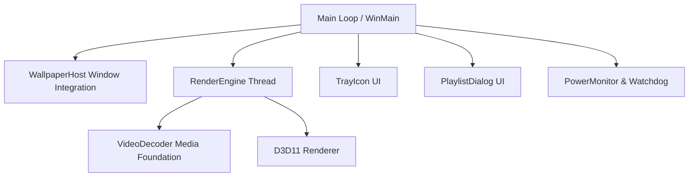

# Windows Live Wallpaper Engine

A lightweight, high-performance, native Windows Live Wallpaper engine written in modern C++17. It integrates directly into the Windows desktop shell (`WorkerW`) to render hardware-accelerated video wallpapers behind your desktop icons with minimal CPU/GPU overhead.

---

## 🚀 Key Features

*   **Native Windows Shell Integration:** Automatically hooks into `Progman` and spawns a background `WorkerW` window. Renders seamlessly behind your desktop icons and files.
*   **Hardware-Accelerated Video Decoding:** Leverages **Windows Media Foundation** (Hardware MFTs) to decode video files with minimal CPU usage.
*   **Direct3D 11 Rendering:** Renders decoded frames directly to the screen using a dedicated background thread for buttery smooth playback.
*   **Smart Power & Idle Management:**
    *   Pauses playback when full-screen applications or games are in focus to maximize system performance.
    *   Pauses when the computer is idle (default: 5 minutes) or enters low power states.
*   **System Tray Control Center:**
    *   Quick play, pause, and exit.
    *   Choose single videos or manage a full playlist.
    *   Set custom rotation intervals (e.g., change video every 5, 10, or 30 minutes).
*   **Interactive Playlist Manager:** Dedicated Dialog UI to add, remove, and order wallpaper videos.
*   **Crash Recovery Watchdog:** Detects Windows Explorer crashes/restarts and automatically re-injects the wallpaper without user intervention.
*   **Self-Rotating Diagnostics:** Built-in lightweight logger writing to `%APPDATA%\LiveWallpaper\log.txt` with automatic log rotation when the log size exceeds 1MB.

---

## 🛠️ Prerequisites

To build and run this project, you need:

1.  **Operating System:** Windows 10 or Windows 11.
2.  **Compiler:** Microsoft Visual C++ Compiler (MSVC) supporting C++17 (Visual Studio 2019 or later recommended).
3.  **Build System:** [CMake](https://cmake.org/download/) version 3.20 or higher.
4.  **SDKs:** Windows SDK (automatically installed with C++ development tools in Visual Studio).

---

## 🏗️ Build Instructions

### Method 1: Using Visual Studio (Recommended)

1.  Open Visual Studio.
2.  Select **Open a local folder** and navigate to the project directory.
3.  Visual Studio will automatically detect the `CMakeLists.txt` and configure the project.
4.  Select `LiveWallpaper.exe` as the startup item.
5.  Press **F5** (Debug) or **Ctrl+F5** (Release) to build and run.

### Method 2: Command Line (CMake)

Open **Developer PowerShell / Command Prompt for Visual Studio** or standard PowerShell with CMake and MSVC in your PATH:

```powershell
# 1. Create a build directory
mkdir build
cd build

# 2. Configure the project using CMake
cmake -DCMAKE_BUILD_TYPE=Release ..

# 3. Build the executable
cmake --build . --config Release
```

The compiled executable `LiveWallpaper.exe` will be located under the `build/Release` folder (or just `build` depending on the generator).

---

## 🏃 How to Run & Configure

### Launching the Engine

Double-click `LiveWallpaper.exe` to start the app. 

*   Upon startup, the app runs in the background. You'll see a new icon in the **System Tray** (near the clock).
*   If no wallpaper is configured, the application will attempt to load a fallback video path or prompt you to select a video.

### Tray Icon Options

Right-click the Live Wallpaper tray icon to open the menu:

| Option | Description |
| :--- | :--- |
| **Play / Pause** | Toggle wallpaper playback manual pause. |
| **Next Video** | Skip to the next video in your playlist. |
| **Manage Playlist...** | Open the Playlist Manager to add, remove, and order videos. |
| **Add Video...** | Add a single video file directly to the current playlist. |
| **Clear Playlist** | Remove all videos from the playlist. |
| **Rotation Interval** | Set a rotation time (1m, 5m, 10m, 30m, or manual) to automatically cycle videos. |
| **Exit** | Restores the default Windows static wallpaper and exits the engine. |

---

## ⚙️ Configuration & Files

Config and log files are stored under the user's `AppData` directory:

*   **Config File Path:** `%APPDATA%\LiveWallpaper\config.ini`
*   **Log File Path:** `%APPDATA%\LiveWallpaper\log.txt`

### Manual Config Example (`config.ini`)

You can also edit settings manually when the app is not running:

```ini
[Settings]
VideoPath=C:\Path\To\Your\CurrentVideo.mp4
Playlist=C:\Path\To\Video1.mp4|C:\Path\To\Video2.mp4|C:\Path\To\Video3.mp4
Paused=0
RotationInterval=10
IdleTimeout=5
```

---

## 🔧 Architecture & Internal Components



*   [main.cpp](file:///d:/CODE/Utlities/LiveWallpaper/src/main.cpp): Main message loop, tray event dispatching, and timer monitoring.
*   [wallpaper_host.cpp](file:///d:/CODE/Utlities/LiveWallpaper/src/wallpaper_host.cpp): Instantiates a child window behind desktop icons via `WorkerW` injection. Recovers automatically if explorer restarts.
*   [renderer.cpp](file:///d:/CODE/Utlities/LiveWallpaper/src/renderer.cpp): Handles Direct3D 11 device initialization, swap chains, shader compiling, and video texture rendering.
*   [video_decoder.cpp](file:///d:/CODE/Utlities/LiveWallpaper/src/video_decoder.cpp): Reads video containers, decodes audio/video formats using hardware-accelerated Media Foundation API, and outputs presentation-ready frames.
*   [power_monitor.cpp](file:///d:/CODE/Utlities/LiveWallpaper/src/power_monitor.cpp): Tracks active window fullscreen states, battery status, and idle timers to pause rendering when resources are needed elsewhere.
